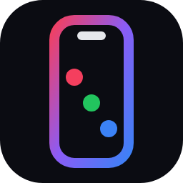
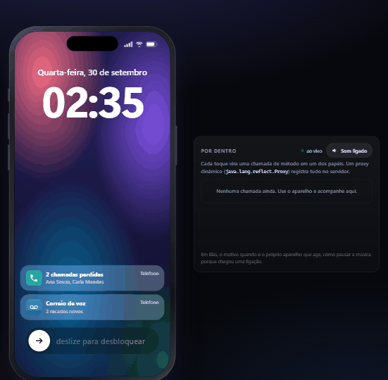
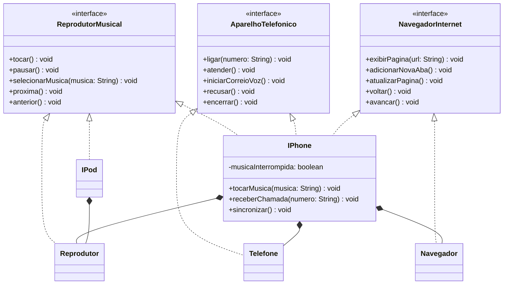
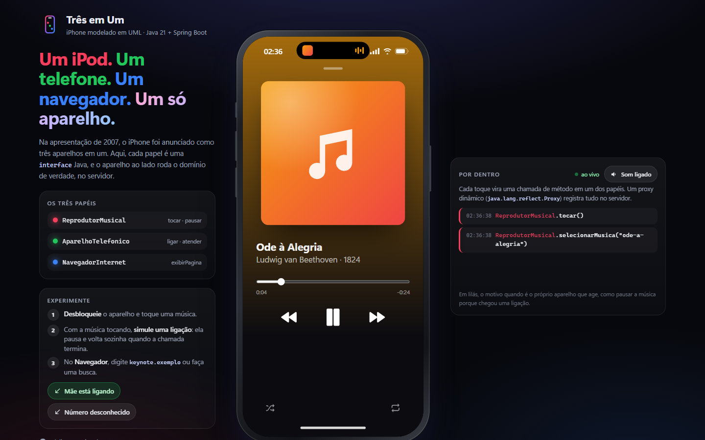
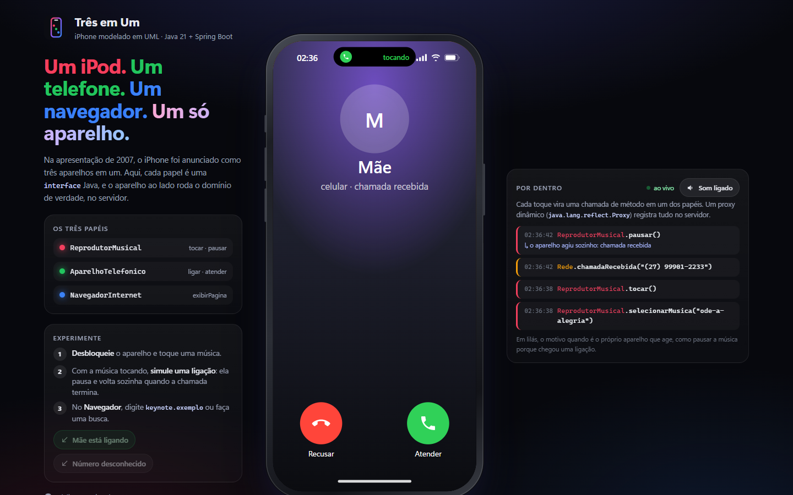
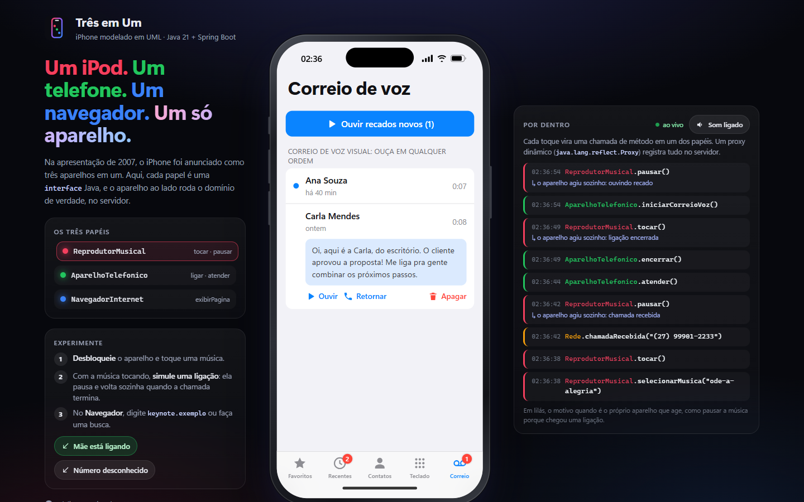
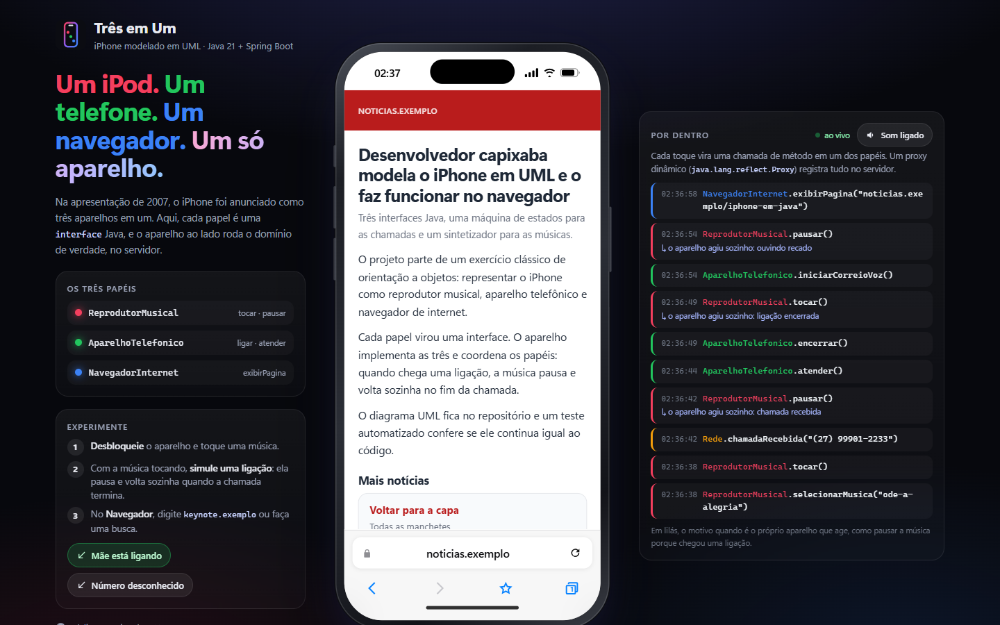

<p align="center">
  
</p>

<h1 align="center">Três em Um</h1>

<p align="center">
  <b>Um iPod. Um telefone. Um navegador. Um só aparelho.</b><br>
  O iPhone modelado em UML, com cada papel virando uma interface Java, o domínio rodando no servidor<br>
  e um aparelho no navegador que mostra, ao vivo, cada método chamado por dentro.
</p>

<p align="center">
  <a href="https://github.com/barbozadevti/tres-em-um/actions/workflows/ci.yml"></a>
  
  
  
  
</p>

<p align="center">
  
</p>

## Experimente

```bash
mvn spring-boot:run
```

Abra **http://localhost:5260** (JDK 21 e Maven). Com Docker: `docker build -t tres-em-um . && docker run -p 5260:5260 tres-em-um`. No Windows, o atalho `Abrir Tres em Um.cmd` compila na primeira vez e abre o navegador.

Em 1 minuto:

1. **Deslize para desbloquear** e toque uma música. O som é de verdade, sintetizado no navegador.
2. Com a música tocando, clique em **"Mãe está ligando"** (ao lado do aparelho). A música pausa sozinha; atenda, desligue, e ela volta do ponto em que parou, como na apresentação de 2007.
3. Acompanhe o painel **Por dentro**: cada toque vira uma chamada de método, e as ações que o próprio aparelho toma aparecem com o motivo.
4. No **Navegador**, digite `keynote.exemplo`, uma busca como `moqueca`, abra uma aba privada.

## O desafio e o que foi além

O ponto de partida é o desafio de modelagem da DIO ([entrega original](https://github.com/barbozadevti/java-iphone-uml)): diagramar em UML os papéis do iPhone de **reprodutor musical**, **aparelho telefônico** e **navegador na internet** e criar as classes e interfaces em Java.

| No desafio | No Três em Um |
|---|---|
| Interfaces `ReprodutorMusical`, `AparelhoTelefonico`, `NavegadorInternet` | As mesmas, com os métodos pedidos (`tocar`, `pausar`, `selecionarMusica`, `ligar`, `atender`, `iniciarCorreioVoz`, `exibirPagina`, `adicionarNovaAba`, `atualizarPagina`) e alguns a mais |
| Classe `iPhone` que implementa as três | `IPhone` implementa as três **por composição**: delega a `Reprodutor`, `Telefone` e `Navegador`, e só coordena os papéis |
| Diagrama feito numa ferramenta UML | Diagrama em Mermaid no repositório, **conferido por um teste**: se o código mudar e o diagrama não, o build quebra |
| Métodos com `System.out.println` | Regras de verdade: fila com aleatório e repetição, números brasileiros, máquina de estados da chamada, histórico de navegação por aba |

## O modelo



O diagrama completo, com atributos, `Chamada`, `Aba`, `Faixa` e o `Rastreador`, está em [`docs/uml/tres-em-um.mmd`](docs/uml/tres-em-um.mmd) ([imagem](docs/uml/tres-em-um.svg)) e também dentro do aparelho, no app **Diagrama**.

- **Segregação de interfaces:** o `IPod` implementa só `ReprodutorMusical` e reaproveita o mesmo `Reprodutor`, sem carregar métodos de telefone.
- **Composição em vez de uma classe gigante:** cada papel tem um especialista testado isoladamente; o `IPhone` acrescenta só o que é do aparelho, a coordenação entre papéis.
- **Proxy dinâmico:** cada papel é acessado por um `java.lang.reflect.Proxy` que registra as chamadas. É o mesmo mecanismo que o Spring usa em `@Transactional`, e é o que alimenta o painel **Por dentro**.

## Funcionalidades

<table>
  <tr>
    <td></td>
    <td></td>
  </tr>
  <tr>
    <td></td>
    <td></td>
  </tr>
</table>

### Reprodutor musical
- Seis músicas de **domínio público** (Beethoven, Pachelbel, Petzold...), transcritas nota a nota. A API envia a partitura e o navegador toca com um sintetizador em **Web Audio**. A duração calculada no Java é a mesma que se ouve.
- Fila, **aleatório** com sorteio repetível, **repetição** (desligada, todas, uma), anterior que recomeça a música depois de 3 segundos, barra de progresso.
- A posição não é gravada a cada segundo: é calculada pelo **relógio** (tempo acumulado + tempo desde o último "tocar"), e a fila avança sozinha quando a música acaba.

### Aparelho telefônico
- **Números brasileiros** como se digita no dia a dia: `(27) 99876-5432`, `+55 11 ...`, `3223-4567` (usa o DDD do aparelho), `0800 ...`, `190`. DDD inexistente, celular sem o 9 e fixo começando com 9 são recusados com a explicação.
- **Máquina de estados** da chamada (`CHAMANDO`/`TOCANDO` → `EM_ANDAMENTO` → `ENCERRADA`) com o desfecho: concluída, cancelada, não atendida, perdida, recusada.
- O outro lado atende em 4 segundos (alguns contatos nunca atendem); ligação recebida e não atendida em 20 segundos vira **chamada perdida** e deixa **recado**.
- **Correio de voz visual**, a novidade de 2007: recados em lista, ouvidos em qualquer ordem (a fala é da síntese de voz do navegador). `iniciarCorreioVoz()` toca o recado novo mais antigo.
- Teclado com **tons DTMF** reais (duas frequências por tecla), tom de chamando brasileiro (425 Hz), mudo, viva-voz e teclas durante a chamada.

### Navegador na internet
- Barra de endereços que entende endereço ou busca (`clima.exemplo` vira `https://clima.exemplo/`, `moqueca capixaba` vira busca) e **recusa** `javascript:`, `file:` e `data:`.
- Até 8 **abas**, cada uma com seu histórico de voltar e avançar; **abas privadas** não entram nas páginas visitadas; favoritos; atualizar.
- Uma pequena "internet" de **sites fictícios** (`noticias.exemplo`, `clima.exemplo`, `receitas.exemplo`, `keynote.exemplo`), servida pelo backend. Sites reais não abrem dentro de outra página, e assim a navegação inteira fica testável. As páginas são blocos de uma `sealed interface`, convertidos na API com `switch` exaustivo.

### O aparelho
- Tela de **bloqueio** com "deslize para desbloquear", notificações de chamadas perdidas e recados.
- **Ilha dinâmica** que mostra a música tocando ou o tempo da chamada.
- Cada visitante tem **o próprio aparelho**, guardado na sessão (sem banco de dados).
- Funciona no celular e no computador; tema escuro de palco de keynote.

## Decisões de engenharia

| Tema | Decisão |
|---|---|
| O diagrama não mente | `DiagramaUmlTest` lê o `.mmd` e confere, por reflexão, cada classe, atributo, método (com número de parâmetros) e relação (realização, composição). Também exige que todo método das três interfaces esteja desenhado. |
| Tempo | Tudo que depende de tempo (posição da música, o outro lado atender, chamada perdida) usa um `Clock` injetado. Os testes usam um relógio que só anda quando mandam: nada de `sleep`. |
| Estado por visitante | O `IPhone` é um bean `@SessionScope`. Os métodos são `synchronized` e a API usa `executar(...)` para fazer a ação e montar a resposta sem outro pedido no meio. |
| Respostas | O domínio não vai direto para o JSON: `Respostas` monta só o que a tela usa. Erros em `problem+json` (RFC 9457): `422` para regra (número inválido), `409` para estado (pausar sem nada tocando), `400` para dados malformados. |
| Frontend | Módulos JavaScript sem framework. A tela só é redesenhada quando o HTML muda, e os valores que andam com o tempo (posição, duração da chamada) são atualizados à parte, interpolando entre as consultas. |
| Segurança | Política de conteúdo (CSP) sem nada inline, `nosniff`, e links para fora do simulador abrindo com `noopener`. |
| Direitos autorais | Só melodias de domínio público, com a transcrição feita no projeto; toque de chamada original. |

## Testes

```bash
mvn verify
```

**140 testes**, também no GitHub Actions (com teste de fumaça do jar e da imagem Docker):

| Área | O que é verificado |
|---|---|
| Diagrama UML | Cada classe, atributo, método e relação do diagrama existe no código (e o teste falha se alguém sabotar o diagrama) |
| Reprodutor | Tempo pelo relógio, fim da fila, repetir todas e uma, várias músicas passando de uma vez, aleatório repetível, anterior depois de 3 s |
| Telefone | 7 formatos de número aceitos e 9 recusados com o motivo, as 16 combinações da máquina de estados, perdida com recado, correio de voz |
| Navegador | Endereço x busca, esquemas perigosos, voltar/avançar, limite de abas, aba privada, busca sem acento |
| iPhone | A cena de 2007 (música pausa e volta), ligação que cai sozinha, o rastro do proxy com motivo e erro |
| API | Um aparelho por sessão, cada rota dos três papéis, `problem+json`, CSP, OpenAPI |

## Arquitetura

```
src/main/java/dev/barboza/tresemum/
├── papeis/      ReprodutorMusical, AparelhoTelefonico, NavegadorInternet (as interfaces do desafio)
├── musica/      Reprodutor, Biblioteca, Faixa, Partitura
├── telefone/    Telefone, Chamada (máquina de estados), Numero, Agenda, Recado
├── navegador/   Navegador, Aba, Endereco, Web (sites fictícios), Pagina, Bloco (sealed)
├── aparelho/    IPhone, IPod, Rastreador (proxy dinâmico), Rastro
├── api/         AparelhoController, Respostas, TratamentoDeErros
└── config/      relógio, aparelho por sessão, OpenAPI, CSP
src/main/resources/static/js/   app, estado, som (Web Audio), musica, telefone, navegador, extras, ui
```

A API está documentada em **/swagger-ui.html**, com as rotas agrupadas pelos três papéis.

## Produto

Visão, personas, jornadas e a ordem das entregas estão na [Lean Inception](docs/lean-inception.md). Próxima onda: mensagens (SMS) e contatos editáveis.
